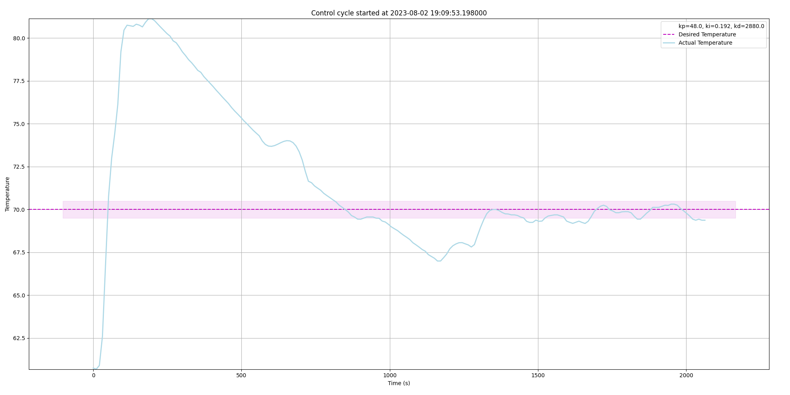

(evaluation)=
# 🧐 PID control analysis
This little script reads the logs saved by the backend, which are based on the messages sent to the MQTT broker and generates a graph for every control cycle of the pico.

This helps with analysing the influence of the PID values and the resulting temperature curve. The results look like the following:

Here, the setpoint for the PID controller is 70 degrees, since this graph was derived during the tuning period and lower temperatures made the tuning process less time-consuming in case of an initial overshoot and the following cooldown time.

The purple area denotes a deviation of +/- 0.5 °C from the actual desired temperature.
