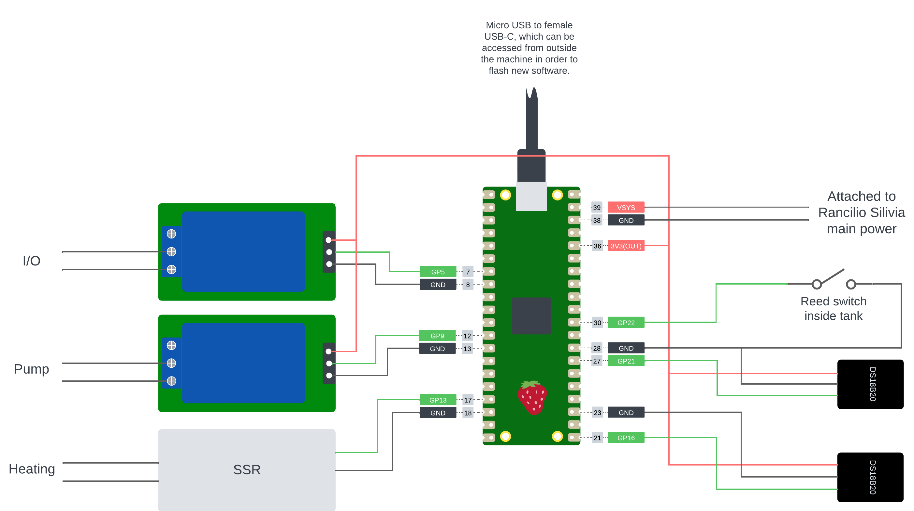

(quickstart)=
# Quickstart
## Shopping list
In order to exactly follow along this tutorial, you will have to buy the following:
* raspberry pico w
* jumper wires
* solid state relais (for the heating): https://www.amazon.de/dp/B08FWV56SP?psc=1&ref=ppx_yo2ov_dt_b_product_details
* water tank reed sensor: https://de.aliexpress.com/item/1005004679552782.html?gatewayAdapt=glo2deu
* DS18B20 temperature sensor: https://de.aliexpress.com/item/33040146828.html?gatewayAdapt=glo2deu
* relais module: https://de.aliexpress.com/item/1005003773145779.html?gatewayAdapt=glo2deu
* heat transferring glue: https://www.amazon.de/dp/B014I7SFN4?psc=1&ref=ppx_yo2ov_dt_b_product_details
* optional: If you want to power your pico w with your machine a voltage converter from 230V to 5V. I just used an old phone charger.

## Overview
The setup consists of the following steps:
* [Setup hardware](#setup-hardware)
* [Setup pico](#setup-pico)
* [Connect pico to your wifi](#connect-pico-to-your-wifi)
* [Setup MQTT broker](#setup-mqtt-broker)
* [Configure backend](#configure-backend)
* [Start the backend](#start-the-backend)
* [Configure frontend](#configure-frontend)
* [Start the frontend](#start-the-frontend)
* [Enjoy your coffee](#enjoy-your-coffee)

## Setup hardware
This is the only step, for which I cannot give a proper configuration since it highly depends on your personal setup and coffee machine. However, in the following I have included a diagram showing my setup with the respective hardware used such as links to purchase the components.



Considering you have set up the hardware like in the image shown above, make a note of the pins for the all your devices, since you'll need them later to configure your PICO. We will call them like this in the following for easier referencing:
* **PIN_IO**: the pin to which the I/O of the machine is connected to (GP5 in my setup)
* **PIN_PUMP**: the pin to which the pump of the machine is connected to (GP9 in my setup)
* **PIN_HEAT**: the pin to which the heating element of the machine is connected to (GP13 in my setup)
* **PIN_TANK**: the pin to which the tank reed sensor is connected to (GP22 in my setup)
* **PIN_SENSOR**: the pin to which the temperature sensor attached to the tank is connected to (GP16 in my setup)
* **PIN_SENSOR_REF**: the pin to which the reference temperature sensor attached to the bottom of the machine is connected to (GP21 in my setup)

## Setup PICO
In a first step you will have to configure your pin layout inside the _pico/config.py_ intended for configuring the pico base values. Configuring the pin layout according to your pin layout will suffice to run the rest of the software (if you stuck to my example, you won't have to configure anything for the software and hardware to run properly). However, if you are interested in fine-tuning your pico configuration, see _README.md_ for more detail.

When you're done with your configuration, copy the content of the _pico_ folder to your pico using i.e. [Thonny](https://thonny.org/). 

## Connect PICO to your WIFI
When the code was successfully copied to the pico and upon connecting the pico to a power source the first time, the pico will provide an access point, which can be accessed via:

```
ssid: SmartCoffee Pico
pw: iWantCoffee
```
To configure the pico for your wifi, run the following command replacing $password and $ssid with the values for your network:

```shell
curl -X PUT http://192.168.4.1:88/pico/wifi
    -H "Content-Type: application/json" 
    -d '{
          "wlan_pw": "$password",
          "wlan_ssid": "$ssid"
        }'" 
```

After this, the pico will connect to your local wifi network and the LED will stop flashing as soon as the connection has been successful. After a successful connection the pico will show up as Rancilio-Silvia in your network (or under another hostname, if you changed the pico's hostname in _pico/config.py_)

## Setup MQTT broker
⚠️ This feature is optional. However, if you want to setup your pico's PID controller, without it being connected to a computer, this is the only way to pull realtime log messages about your controller to your local machine. If you do not want to use this feature, make sure to not turn on the MQTT setting in the _frontend/src/model/pico-config-dto.ts_, since this will result in constant connection errors to the MQTT broker and make the pico super slow.

To provide a light-weight realtime messaging-system between the pico and the other parts of the software, I am using a MQTT broker. MQTT is a lightweight messaging protocol especially suited for low power machines such as microcontrollers. There are many different providers for an MQTT broker, but I am using [mosquitto](https://mosquitto.org/download/), which can be easily installed on any system. for linux simply run:

```shell
sudo apt-add-repository ppa:mosquitto-dev/mosquitto-ppa
sudo apt-get update
sudo apt-get install mosquitto
```

On Ubuntu, the firewall should at this point already be configured correctly. However, if you're running into connection issues, check that port 1883 allows incoming connections on your MQTT broker host machine. For more information see the [mosquitto documentation](https://mosquitto.org/man/mosquitto-8.html).

## Configure backend
The configuration in the backend is done in the _backend/.env_ of the backend module. Here, you will have to configure the following values, based on your personal setup:
* **PORT**: Port under which the backend will run (defaults to 3001)
* **PICO_IP**: The IP address of the pico in the local network
* **PICO_PORT**: 80 (the pico's standard port. Don't change this)
* **MQTT_BROKER_IP**: The IP of the machine, where your MQTT broker is running.
* **MQTT_BROKER_PORT**: The port of the MQTT broker (default 1883)
* **MQTT_TOPIC**: The MQTT topic under which the pico will send its log messages

## Start the backend
After everything is configured and setup to your needs, run the following command inside the backend module

```shell
npm run start
```

When everything worked correctly, you will see the following output on the console:

```shell
❯ backend
❯ npm run start

> backend@1.0.0 start
> node server/index.js

Server listening on 3001
Successfully connected to MQTT broker.
Subscribe to topic pico_log
Pico up and running - connection successful!
Send config from backend to pico!
```

## Configure frontend
The frontend does not need much configuration, simply adjust the proxy in the _frontend/package.json_ to align with your setup as well as adjusting the variable **REACT_APP_BACKEND_IP** inside _frontend/.env_. This variable is needed additionally in order for the websocket between the backend and frontend to work. Through this websocket, messages received by the MQTT subscription are sent from the backend to the frontend.

## Start the frontend
To start the frontend, navigate inside the _frontend_ module and run the following command:
```shell
npm run start
```

If everything worked successfully, you will see the following output on the console:
```shell
❯ frontend
❯ npm run start

> frontend@0.1.0 start
> react-scripts start

Starting the development server...
Compiled with warnings.

```

## Alternative: Backend serves frontend
If you only want to run a single service on your machine, the backend is also configured to serve the frontend as well. If you wanna go this way and not have two different javascript applications running (which makes sense for local development, though), do the following:
* [Configure backend](#configure-backend)
* [Configure frontend](#configure-frontend)
* build frontend via ```npm run build```
* start the backend through ```npm run start```

The UI of the application is then accessible through ```http://localhost:3001/```, since it's served by the backend.

## Enjoy your coffee!
The UI of the application can now be accessed on any browser under (the ip address depends on the machine the application is running on): 
```
    http://localhost:3000/
```
If you can see the Dashboard page, everything worked and the connection to the pico is successful.

