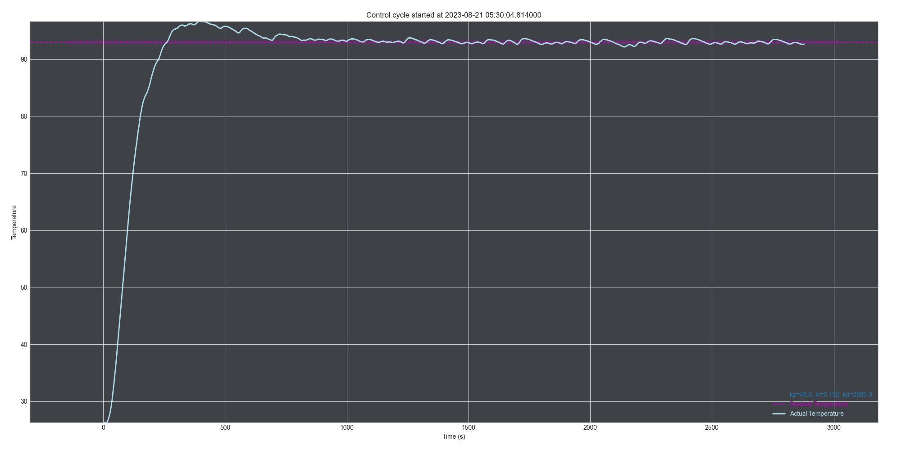

# 🧐 PID control analysis
This little script reads the logs saved by the backend, which are based on the messages sent to the MQTT broker and generates a graph for every control cycle of the pico.

This helps with analysing the influence of the PID values and the resulting temperature curve. The results look like the following:

[README.md](README.md)